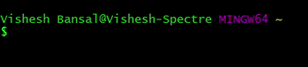

<h2>𝐇𝐞𝐥𝐥𝐨 𝐟𝐞𝐥𝐥𝐨𝐰 <𝚍𝚎𝚟𝚎𝚕𝚘𝚙𝚎𝚛𝚜/>! , I'm Vishesh! </h2>

I'm a Freshman Student at Vellore Institute of Technology, Vellore. 
 

## &#x1f4c8; GitHub Stats

**A Bit More about me:** 
- 😄 Pronouns: He/Him/His
- 🌱 I’m currently learning Python, Django Framework and trying out Web Development.
- 🔭 I’m currently working as a freelancer.
- 💬 Ask me about my views on the future of Artificial Intelligence and Cyber Security. 
- ⚡ Random Fact: I never understood what my music taste is, but everyone I have met vibe with it!    
- 👯 I’m looking to collaborate on small projects on AI, ML and Full Stack Web Development
### _Random joke for you_ 😉

 <em><b>I love connecting with different people</b> so if you want to say <b>Hi!, I'll be happy to meet you more!</b> :)</em>

**Learning and working with:**

<h4> Find me on</h4>

